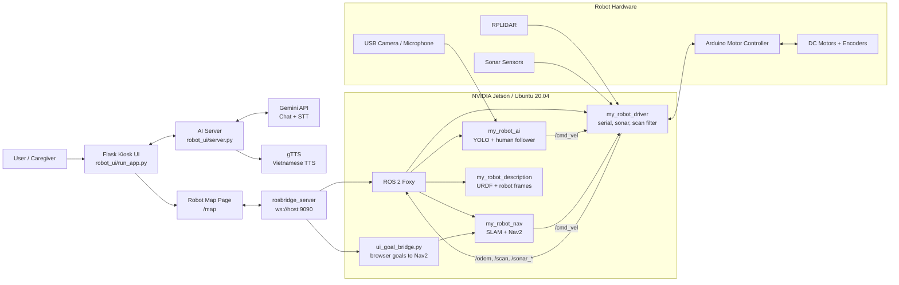

<p align="center">
  
</p>

<p align="center">
  
  
  
  
  
</p>

<p align="center">
  
</p>

## Overview

**Mopero** is a prototype care-assistant robot built around **NVIDIA Jetson + ROS 2 Foxy**. It combines motor control, lidar navigation, sonar safety sensing, camera perception, human-following behavior, and a Flask kiosk interface with a Vietnamese AI voice assistant.

> This project is designed for real-robot experimentation. Hardware ports, model paths, map files, and startup scripts may need to be adjusted for your own Jetson setup.

## Highlights

| Module | What it does |
| --- | --- |
|  | Coordinates robot drivers, navigation, perception, and transforms |
|  | Receives velocity commands and controls the differential-drive motors |
|  | Handles camera-based perception and visual processing |
|  | Provides the kiosk UI and AI assistant endpoints |
|  | Runs ROS 2, AI workloads, and the local user interface |

Core capabilities:

- Differential-drive control through `/cmd_vel`.
- ROS 2 serial bridge for Arduino motor control.
- Encoder odometry publishing on `/odom`.
- RPLIDAR scan publishing and filtering.
- Sonar range publishing for left, center, and right sensors.
- SLAM and Nav2 launch files for mapping and navigation.
- USB camera publishing through `v4l2_camera`.
- YOLO-based person detection and human-following behavior.
- Flask UI on port `5000`.
- Browser map UI for robot pose, initial pose, and navigation goals.
- `rosbridge_server` WebSocket integration on port `9090`.
- AI server on port `5001` with chat, STT, and TTS endpoints.

## System Architecture



## Hardware Setup

| Component | Role |
| --- | --- |
| NVIDIA Jetson | Main compute unit for ROS 2, UI, and AI workloads |
| Arduino motor controller | Receives serial commands and controls the motors |
| DC motors + encoders | Differential-drive movement and odometry feedback |
| RPLIDAR | Laser scan input for mapping and navigation |
| Sonar sensors | Short-range safety sensing |
| USB camera + microphone | Vision input and voice interaction |
| Battery and regulators | Power distribution for robot electronics |

Important robot parameters:

| Parameter | Value |
| --- | --- |
| Wheel radius | `0.085 m` |
| Wheel base | `0.3846 m` |
| Max motor speed | `23 RPM` |
| Base frame | `base_footprint` |
| Odom frame | `odom` |
| Map frame | `map` |

---

## Instructions

### 1. Prerequisites
- **OS**: Ubuntu 20.04
- **ROS 2**: Foxy
- **Python**: 3.8
- **Hardware**: NVIDIA Jetson

### 2. Installation
```bash
# Clone the repository
git clone https://github.com/namdaza/mopero.git
cd mopero

# Build the ROS 2 workspace
source /opt/ros/foxy/setup.bash
cd ros2_ws
colcon build --symlink-install
source install/setup.bash

# Configure USB device names
sudo ./install_udev_rules.sh
sudo udevadm control --reload-rules && sudo udevadm trigger

# Configure the UI and AI server
cd ~/mopero/robot_ui
cp .env.example .env
nano .env # Add your Gemini API key and admin passwords here
```

### 3. Usage
You can start the entire robot stack (ROS navigation, rosbridge, AI server, and browser UI) using the provided launcher:

```bash
cd ~/mopero/robot_ui/robot_launcher
bash ./start_robot_stack.sh
```

**Accessing the Interfaces:**
- **Main UI:** `http://localhost:5000/`
- **Robot Map:** `http://localhost:5000/map`
- **AI Camera (Human Following):** `http://localhost:5000/human-following`
- **Debug Stream:** `http://localhost:5002/`

**To stop the stack:**
```bash
cd ~/mopero/ros2_ws
bash ./stop_robot_stack.sh
```

### 4. Development Notes
- The admin map page is accessed via the **Trang Quản Lý** button.
- Make sure to use udev symlinks (e.g. `/dev/arduino_motor`, `/dev/lidar`, `/dev/arduino_sonar`) instead of raw `ttyUSB*` ports.
- The YOLO node uses `LD_PRELOAD=/usr/lib/aarch64-linux-gnu/libgomp.so.1` to avoid memory allocation errors on the Jetson Nano. This is handled automatically by the web UI launcher.
